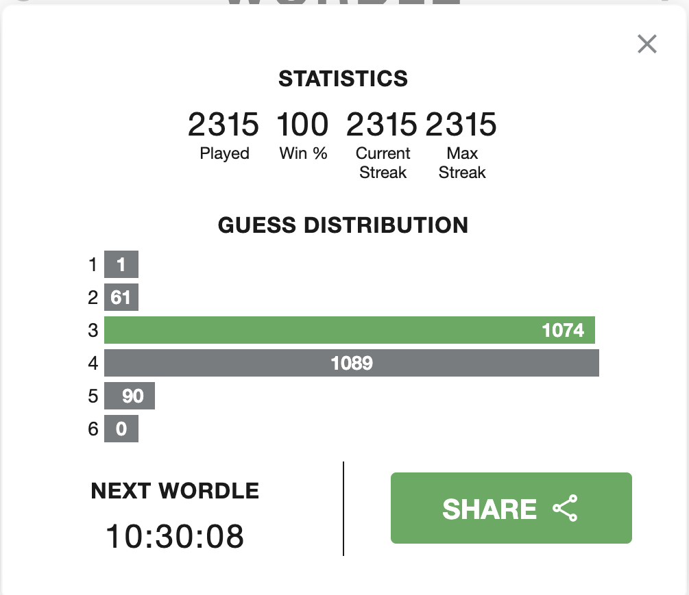

# wordle-solver
Simple python program for solving [Wordle](https://www.powerlanguage.co.uk/wordle/) puzzles

Usage:

Interactive mode:

`python wordle_solver --word-file "words.txt"`

Solving for a particular answer:

`python wordle_solver --word-file "words.txt" --word "happy"`

Solving for all possible answers:

`python wordle_solver --word-file "words.txt" --word "all"`

The average number of guesses required is 3.52.

